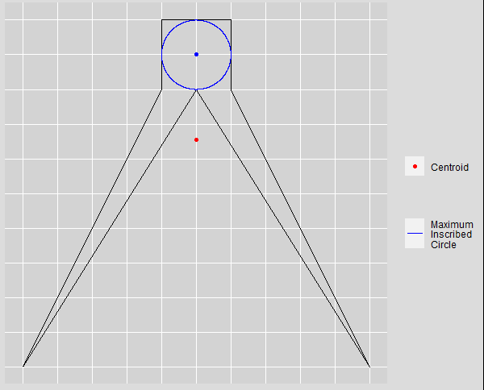
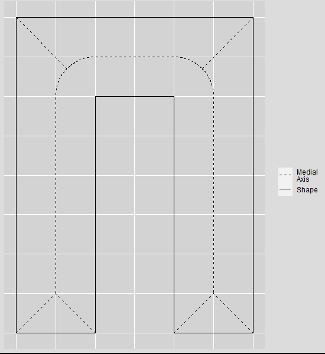
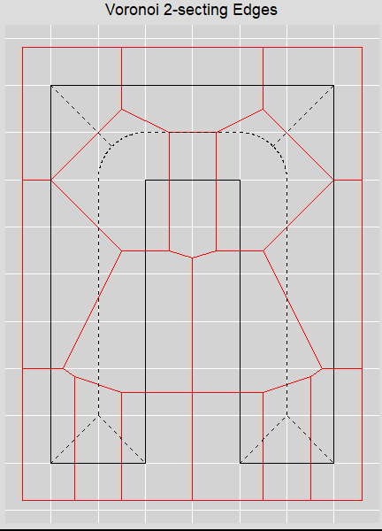
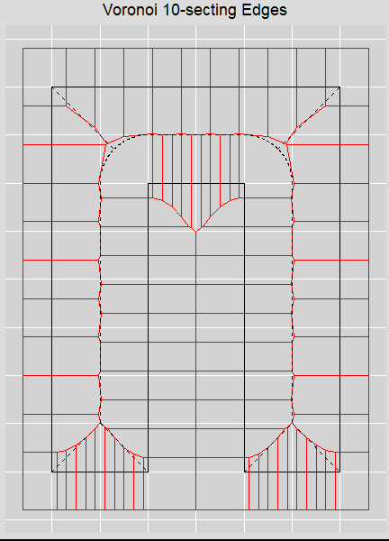
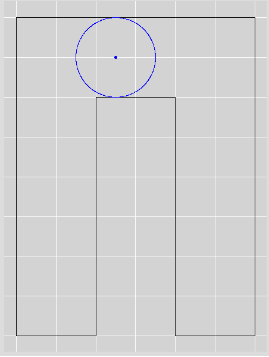
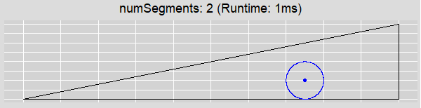
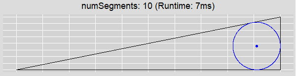
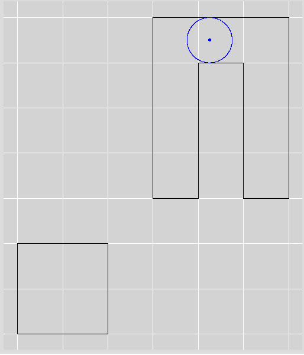

# User Guide

## Background

The goal of this library is to automatically calculate an optimal point that is always guaranteed to fall inside a
polygon. It was conceived when trying to optimize label placement in geometric shape data. Initial attempts at label
placement used the centroid. However, non-convex shapes were quite common and often labels would get drawn outside
the shape. Additionally, many shapes had centroids that resulted in label locations that did not look good to the naked
eye, typically residing in small areas of the shape such as narrow strips or near holes.

After some visual analysis and research, it became obvious that the optimal location for label placement would be at
the center of the largest circle that can be inscribed in the shape. This location is optimal as it is the part of the
shape that has the most space around it.



This circle, known as the maximum inscribed circle, will always have its center lie on the
[medial axis](https://en.wikipedia.org/wiki/Medial_axis) of the shape. The medial axis can be thought of as the bone
structure of a shape, where every point on the medial axis has at least two equidistant closest points on the shape.



*Note, the previous example is a manual approximation and is not 100% accurate, particularly in the curved segments.*

A [Voronoi diagram](https://en.wikipedia.org/wiki/Voronoi_diagram) over the discretized edges of the shape can be used
to approximate the medial axis and, as the discretized points tend to infinity the diagram will start to converge to
the medial axis.




It is quite evident in the above plots how the Voronoi diagram becomes much closer to the medial axis as we go from
2-secting (bisecting) to 10-secting the edges of the shape.

## Usage

This library can be installed from NPM.

```bash
npm install max-inscribed-circle
```

To run it, simply import it and pass it a GeoJSON Polygon or MultiPolygon.

```javascript
import maxInscribedCircle from 'max-inscribed-circle';
const polygon = {
    "type": "Feature",
    "geometry": {
        "type": "Polygon",
        "coordinates": [[
            [0.0,0.0],
            [1.0,0.0],
            [1.0,3.0],
            [2.0,3.0],
            [2.0,0.0],
            [3.0,0.0],
            [3.0,4.0],
            [0.0,4.0],
            [0.0,0.0]
        ]]
    }
};

console.log(maxInscribedCircle(polygon));
/*
{
    "type": "Feature",
    "geometry": {
        "type": "Point",
        "coordinates": [1.25,3.5]
    },
    "properties": {
        "radius": 0.4994165362629234,
        "units": "degrees"
    }
}
*/
```



There are actually infinitely many maximum inscribed circles in this sample shape. This library returns the first one
it finds. Additionally, due to floating point issues with JavaScript, the radius will not always be as accurate as we
like. Mathematically we know the radius of the circle is 0.5 but we can see this is not what is returned by the library.

### Coordinate Units

It is important to note that due to the underlying [turf](https://turfjs.org/) dependencies, this library has been
written to work primarily with `(lat,lon)` coordinates. If the polygon is in a known projection then it is recommended
you transform it to `WGS84 (EPSG:4326)`. The [reproject](https://github.com/perliedman/reproject) and
[pro4](https://github.com/proj4js/proj4js) libraries on NPM are good for this.

## Options

There are three different options that can be specified when executing `maxInscribedCircle`. They are `numSegments`,
`units`, and `decimalPlaces`. Each of these is documented in their own subsection below.

### `numSegments` - default `2`

`numSegments` how many times to split each edge when generating the sites on which to create the Voronoi diagram. As
was mentioned in the in Background section, if we split the edges into infinitely many points the Voronoi diagram would
converge to the medial axis. Therefore, as `numSegments` increases the accuracy of our approximation will too increase.
This was seen in the 2-secting and 10-secting sample images in the Background.

Note that the higher the value of `numSegments`, the longer the calculation will take. Below are two images that
demonstrate the increased accuracy of the maximum inscribed circle approximation as `numSegments` increases. They also
include the runtime. The polygon is defined as follows:

```json
{
    "type": "Feature",
    "geometry": {
        "type": "Polygon",
        "coordinates": [[
            [0, 0],
            [5, 0],
            [5, 1],
            [0, 0]
        ]]
    }
}
```




An additional run was performed using `numSegments: 100`. It took 28ms to run and the results were only marginally
better and well within the floating point error.

### `units` - default `degrees`

As was noted in the Coordinate Units subsection, this library requires input geometries to have their coordinates in
degrees, preferably in the WGS84 projection. Because of this, the returned radius will be in degrees by default.
However, if you wish for the returned radius to be in a different distance unit you can use the `units` option to
change it. The available options are `"degrees"`, `"radians"`, `"miles"`, and `"kilometers"`. Below is sample output
for each of these units using the following polygon:

```json
{
    "type": "Feature",
    "geometry": {
        "type": "Polygon",
        "coordinates": [[
            [0.0,0.0],
            [1.0,0.0],
            [1.0,3.0],
            [2.0,3.0],
            [2.0,0.0],
            [3.0,0.0],
            [3.0,4.0],
            [0.0,4.0],
            [0.0,0.0]
        ]]
    }
}
```

```json
[
    {
        "type": "Feature",
        "geometry": { "type": "Point", "coordinates": [ 1.25, 3.5 ] },
        "properties": { "radius": 0.4994165362629234, "units": "degrees" }
    },
    
    {
        "type": "Feature",
        "geometry": { "type": "Point", "coordinates": [ 1.25, 3.5 ] },
        "properties": { "radius": 0.008726647167630651, "units": "radians" }
    },
    
    {
        "type": "Feature",
        "geometry": { "type": "Point", "coordinates": [ 1.25, 3.5 ] },
        "properties": { "radius": 34.546713381023544, "units": "miles" }
    },
    
    {
        "type": "Feature",
        "geometry": { "type": "Point", "coordinates": [ 1.25, 3.5 ] },
        "properties": { "radius": 55.59754589946995, "units": "kilometers" }
    }
]
```

### `decimalPlaces` - default `1e-20`

`decimalPlaces` is an option that was introduced as a workaround for a bug in the underlying Voronoi library. Certain
polygons can cause the Voronoi library to throw the error `Voronoi.closeCells() > this makes no sense!`. This is a
problem caused by floating point precision and the best workaround found so far has been to decrease the decimal
precision in calculations whenever this error is thrown. Note, using this option to decrease the precision will result
in less accurate estimates of the maximum inscribed circle. As such, this option should **only** be used in the event
a polygon throws this error. In this event, slowly start increasing the value, such as `1e-19` or `1e-18`. If these
do not fix the issue, continue to increase the value moving toward `1e-1`.

## Additional Properties

If there are any additional properties on the passed GeoJSON, these properties will be returned verbatim in the
resulting GeoJSON Point geometry. As an example, if you want to use an identifier to link the result with the input,
set it in `properties` and it will be returned. See the below example:

```json
{
    "type": "Feature",
    "geometry": {
        "type": "Polygon",
        "coordinates": [[
            [0, 0],
            [5, 0],
            [5, 1],
            [0, 0]
        ]]
    },
    "properties": { "id":  1 }
}
```

```json
{
    "type": "Feature",
    "geometry": { "type": "Point", "coordinates": [ 3.75, 0.25 ] },
    "properties": { "id": 1, "radius": 0.25, "units": "degrees" }
}
```

## MultiPolygons

This library accepts GeoJSON MultiPolygons. In the event a multipolygon is passed, this library will take the polygon
of largest area and run the algorithm on this shape. The reasoning behind this decision was that, in the event of
labeling, the polygon of largest areas is most likely where the viewer's eyes will navigate, even if a different
polygon can support a larger inscribed circle. Below is an example that illustrates this. The square at the bottom can
inscribe a circle with radius 1, but the shape above it has a larger area so this is where the maximum inscribed circle
is calculated, even though its maximum inscribed circle only has a radius of 0.5.

```json
{
    "type": "Feature",
    "geometry": {
        "type": "MultiPolygon",
        "coordinates": [[
            [
                [0.0, 0.0],
                [1.0, 0.0],
                [1.0, 3.0],
                [2.0, 3.0],
                [2.0, 0.0],
                [3.0, 0.0],
                [3.0, 4.0],
                [0.0, 4.0],
                [0.0, 0.0]
            ],
            [
                [-3.0, -3.0],
                [-1.0, -3.0],
                [-1.0, -1.0],
                [-3.0, -1.0],
                [-3.0, -3.0]
            ]
        ]]
    }
}
```

